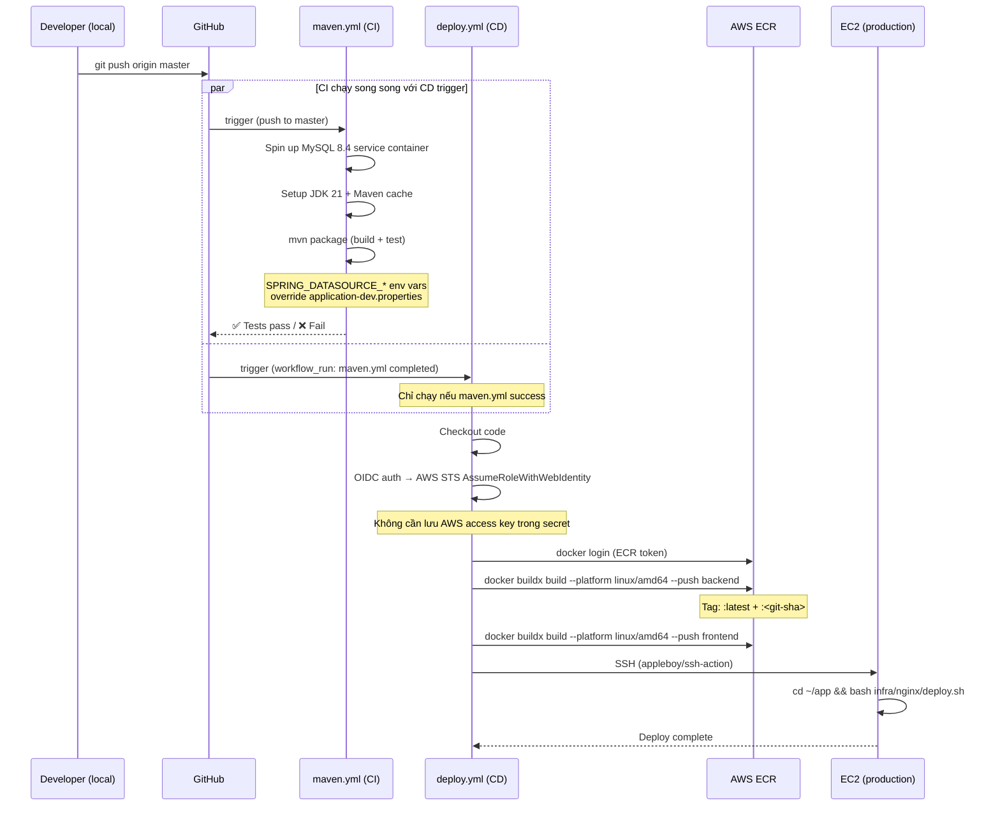
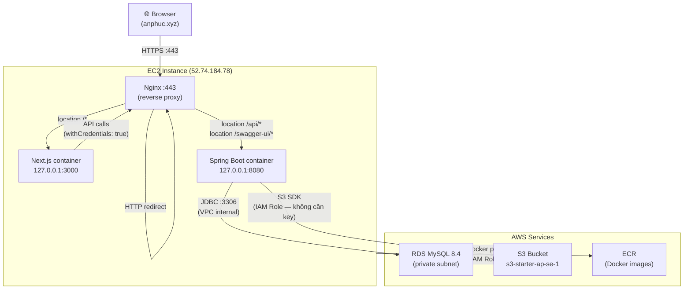
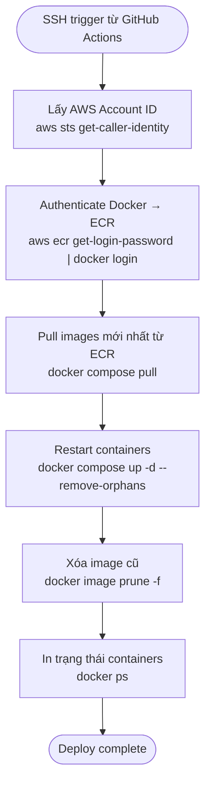

# DevOps Flows

Mô tả 3 flow chính của hệ thống để phục vụ việc học DevOps.

---

## 1. CI/CD Flow — Từ code đến production

Mỗi khi push lên branch `master`, 2 workflow GitHub Actions chạy song song rồi deploy.



### Tại sao thiết kế vậy?

| Quyết định | Lý do |
|------------|-------|
| `workflow_run` trigger | Deploy chỉ chạy sau khi test pass — tránh deploy code lỗi |
| OIDC thay access key | Access key là long-lived secret, dễ leak. OIDC token tự hết hạn sau mỗi job |
| Tag `:latest` + `:<sha>` | `:latest` để deploy script luôn dùng image mới nhất; `:<sha>` để rollback về commit cụ thể |
| `--platform linux/amd64` | Mac M1/M2 build ARM image mặc định — EC2 t3.micro chạy x86, image sẽ crash nếu sai platform |

---

## 2. Request Flow — Từ browser đến database



### Routing rules của Nginx

| Path | Forward đến | Ghi chú |
|------|-------------|---------|
| `http://` bất kỳ | redirect 301 | Force HTTPS |
| `/api/*` | `localhost:8080` | Spring Boot REST API |
| `/swagger-ui/*` | `localhost:8080` | API docs |
| `/v3/api-docs` | `localhost:8080` | OpenAPI spec |
| `/*` (còn lại) | `localhost:3000` | Next.js frontend |

### Tại sao port bind `127.0.0.1` thay vì `0.0.0.0`?

`docker-compose.prod.yml` bind port như sau:
```yaml
ports:
  - "127.0.0.1:8080:8080"   # backend
  - "127.0.0.1:3000:3000"   # frontend
```

Nếu dùng `0.0.0.0:8080:8080`, internet có thể truy cập thẳng vào Spring Boot, bypass Nginx — không qua SSL, không qua security headers. Bind `127.0.0.1` đảm bảo chỉ Nginx (cùng máy) mới đến được containers.

---

## 4. Deploy Script Flow — `infra/nginx/deploy.sh`

Script này chạy trên EC2 mỗi khi GitHub Actions SSH vào để deploy.



### Chi tiết từng bước

**Bước 1 — Lấy Account ID:**
EC2 có IAM Role attached (`EC2-S3AppRole`). `aws sts get-caller-identity` dùng role này, không cần config access key thủ công.

**Bước 2 — ECR auth:**
Token ECR có hạn 12 giờ. Script lấy token mới mỗi lần deploy — không bao giờ dùng token cũ hết hạn.

**Bước 3 — Pull images:**
`docker compose pull` chỉ download layer thay đổi (Docker layer cache). Image 1GB không cần download lại toàn bộ mỗi lần.

**Bước 4 — `up -d --remove-orphans`:**
- `-d`: chạy background (detach)
- `--remove-orphans`: xóa container không còn trong compose file — tránh zombie container từ deploy cũ

**Bước 5 — `image prune -f`:**
Xóa image cũ không còn tag nào trỏ vào. Giải phóng disk space trên EC2.

### Zero-downtime?

Script hiện tại **không** zero-downtime — `up -d` stop container cũ rồi start container mới, có ~5-10 giây downtime. Để zero-downtime cần chuyển sang ECS Fargate (rolling deploy) hoặc dùng blue-green deployment.
